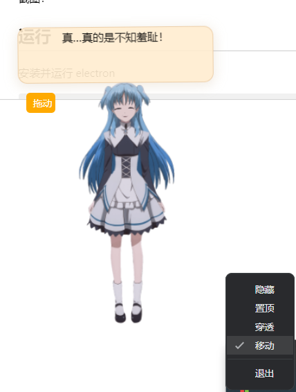

# 珂朵莉 Live2D 桌宠

之前在 GitHub 上找到了[珂朵莉的模型](https://github.com/akikowork/chtholly_kanban)，但模型版本是 Cubism 2.0，而现在几乎找不到 2.0 版本的 Native SDK，现有的 web 版支持 2.0 的模型，而且十分方便，所以魔改了 [live2d-widget](https://github.com/stevenjoezhang/live2d-widget)，增加了读取本地模型的功能（不具有泛用性）。

## 功能

会改源码的话可以在珂朵莉的模型内自定义语音和动作，在 waifu.tips.json 中添加互动文本。

具有鼠标互动，保存模型截图的功能，此外可以移动，鼠标穿透，置顶等模式。

**启动**


**系统托盘**




## 运行

安装并运行 electron
```shell
npm i --save-dev electron
npm run start
```

## 参考
* 仓库魔改自 [live2d-widget](https://github.com/stevenjoezhang/live2d-widget)
* 其中，live2d.min.js 来自 [Live2D](https://github.com/galnetwen/Live2D)，不知道为什么原仓库的 live2d.min.js 不支持语音播放。
